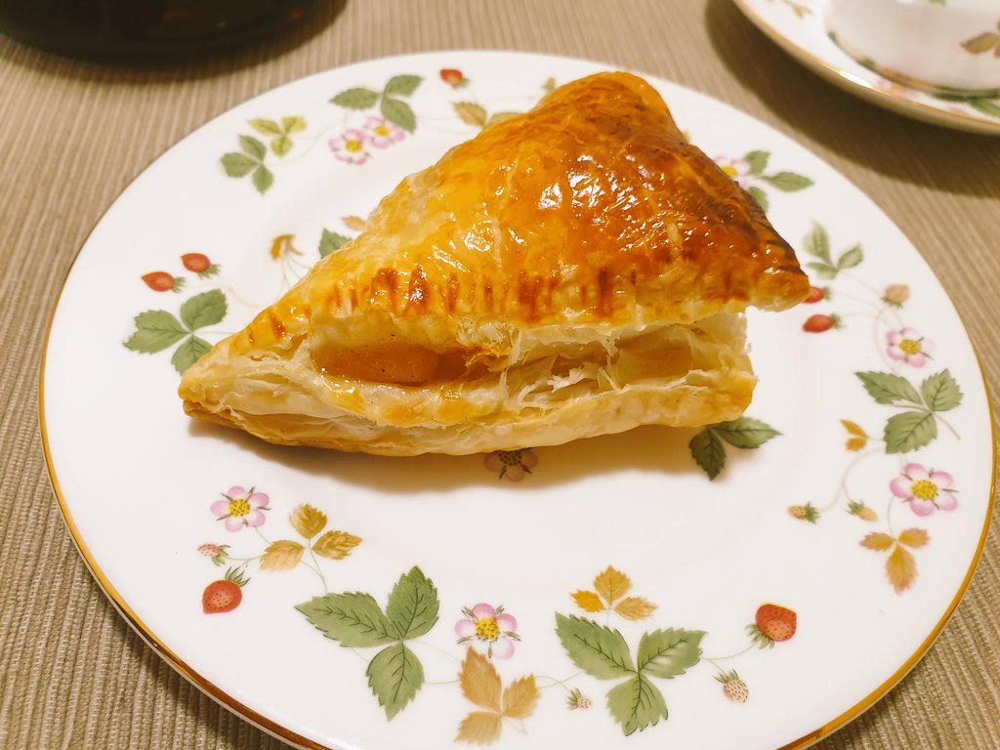

# アップルパイ

## 材料(4 個分)

- リンゴ 2 個
- 砂糖 50g
- 無塩バター 20g
- シナモンパウダー 小さじ 1/2 ～お好み
- 冷凍パイシート 2 枚
- 卵 1/2 個

- クッキングシート
- 麺棒
- 刷毛

## 調理手順

1. リンゴを 4 等分に切って芯を取り、さらにそれぞれ 3 等分に分けた後、小さく切る。
2. 鍋にリンゴ、砂糖、無塩バターを入れて中火で混ぜながら熱する。水分がなくなるまで煮る。
3. シナモンパウダーを入れる。
4. 2 を冷ます。(冷ましている間にパイシートを室温に戻しておく。10 ～ 20 分もあれば十分に解凍できる。)
5. パイシートを半分にカットし、それぞれ正方形に伸ばす。
6. パイシートの真ん中にコンポートを入れる。
7. パイシートを斜め半分に折り、三角形にし、生地の端を上からフォークで抑えくっつける。
8. パイシートの表面に溶き卵を刷毛で塗り、180℃ で余熱したオーブンで 20 ～ 25 分焼く。

## 費用

800 円程度

## 作成時間

60min ～ 90min

## メモ
