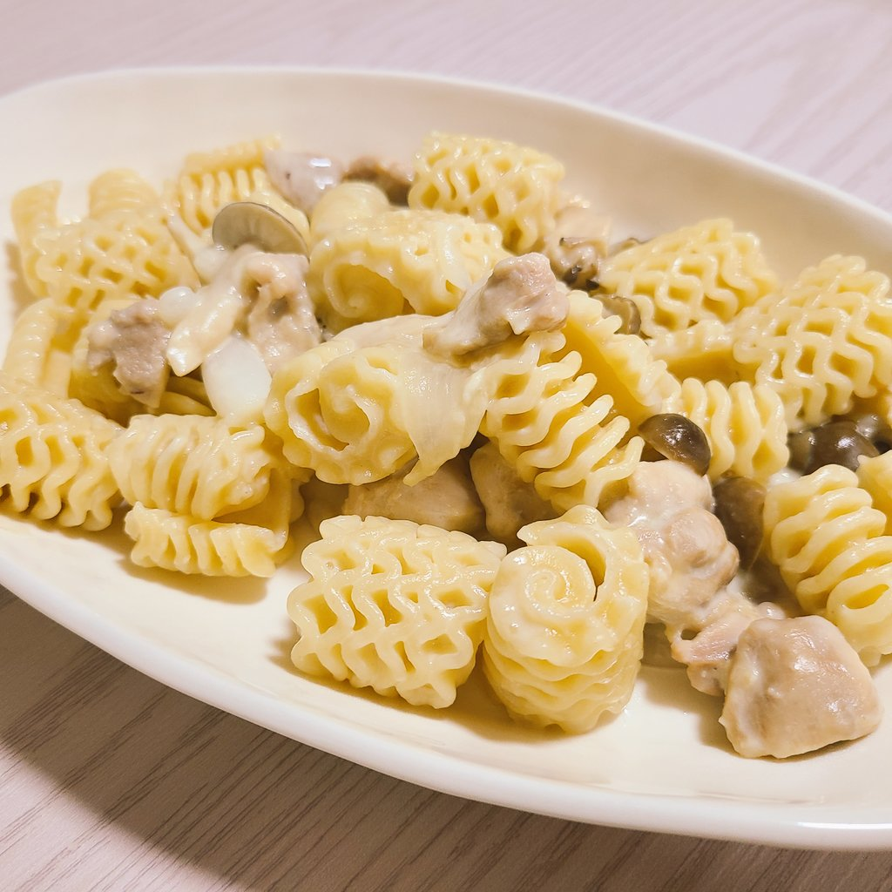

# クリームパスタ

## 材料(1 人前)

- パスタ 100g
- しめじ 50g(1 袋の半分程度)
- 玉ねぎ 1/4 個
- 鶏むね肉 100g

- オリーブオイル 15g
- ニンニクチューブ 2cm
- 牛乳 200ml
- 水 200ml
- コンソメ 5g(固形 1 個 or 顆粒小さじ 1)
- 無塩バター 10g
- 粉チーズ 30g
- ブラックペッパー 適量

## 調理手順

1. 玉ねぎを薄切りにして、しめじは食べやすい大きさに手でほぐす。
2. 鶏むね肉を食べやすい大きさにカットする。(小さめにカットする方が好み。)
3. フライパンにオリーブオイルとニンニクチューブを敷いて熱する。
4. 1 と 2 をフライパンに入れて火が通るまで炒める。
5. 牛乳、水、コンソメ、無塩バターをフライパンに入れる。
6. 5 が沸騰する前にパスタをフライパンに入れ、パスタの茹で時間通りに加熱していく。(長さがあるパスタは半分に折ってから入れる。)
7. 粉チーズを混ぜ、水気がなくなるまで煮詰める。
8. ブラックペッパーを振り、味を整えたら完成。

## 費用

300 円程度

## 作成時間

30min

## メモ
