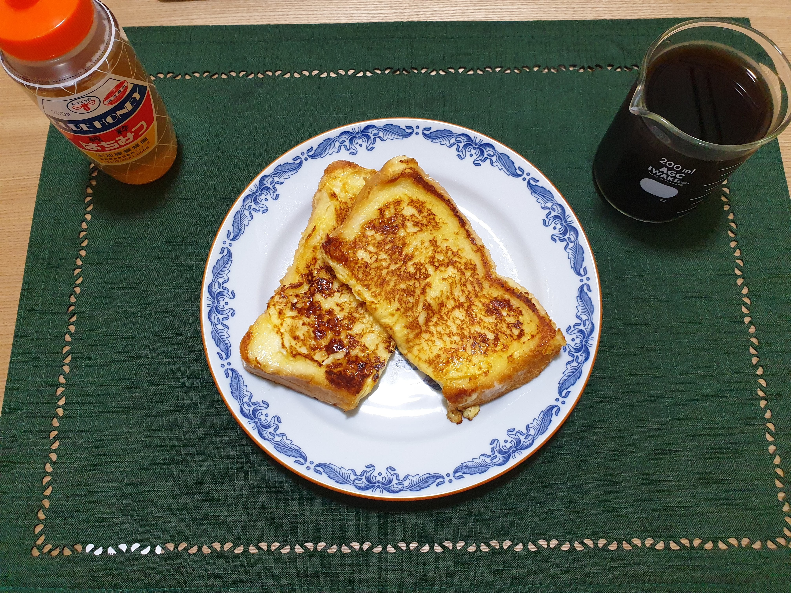

# フレンチトースト

## 材料(1 人前)

- 食パン 1 枚

- 卵液

  - 牛乳 100ml
  - 卵 1 個
  - 砂糖 大さじ 1 杯

- バター 10g
- はちみつ

## 調理手順

1. 卵液を作る。
2. 食パンを半分にカットし 1 に漬ける。
3. 20〜60 分程度冷蔵庫で寝かせる。
4. フライパンを熱し、バターを入れ溶かして 2 を焼く。(焼いてる間は弱火〜中火の間の火加減)
5. 焼き目がついたら裏返し、蓋をして 2 分程度焼く。
6. お皿に盛り付けてはちみつをかけたら完成。

## 費用

70~100 円程度

## 作成時間

15min(手順 3 の時間を除く)

## メモ

記載の卵液は食パン 2 枚に対する分量だけど 1 枚でも問題なし。
